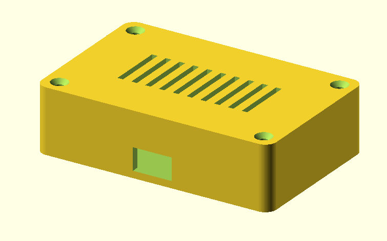

# Parametric Electronics Enclosure — OpenSCAD

A fully parametric, 3D-printable enclosure generator written entirely in OpenSCAD code.
Swap a handful of top-level parameters and regenerate a production-ready base + lid for any PCB in seconds.

---

## The Problem

A client needed a custom enclosure for a small electronics board, but the project required several board size variants and multiple connector layouts.
Traditional GUI-based CAD tools would have meant re-drawing every variant by hand — slow, error-prone, and hard to keep consistent across iterations.

## The Solution

A single parametric script (`enclosure.scad`) that drives the entire geometry from high-level variables: PCB dimensions, wall thickness, corner radius, screw size, lid clearance, and optional cut-outs.
Changing a board size is a one-line edit. New variants regenerate in seconds. All mounting features and tolerances stay consistent automatically.

---

## Renders

> Place exported renders in a `renders/` folder and update the paths below.

| View | Description |
|------|-------------|
|  | Isometric view — closed enclosure, 80 × 50 mm PCB variant |
|  | Exploded view — lid separated to show registration lip and standoffs |
|  | Section cut — internal standoffs, floor thickness, and lid lip depth |
|  | Three size variants demonstrating parametric scaling |

**Suggested render workflow in OpenSCAD:**

```
# Assembled isometric
explode_z = 0;   show_base = true;  show_lid = true;

# Exploded (lid lifted)
explode_z = 20;  show_base = true;  show_lid = true;

# Base only (for STL export)
show_base = true;  show_lid = false;

# Lid only (for STL export)
show_base = false; show_lid = true;
```

---

## Features

- **Parametric base and lid** — both generated from the same parameter set; no manual re-modelling
- **Rounded corners** — `hull()` of corner cylinders gives exact outer dimensions with no origin offset (avoids the Minkowski rounding pitfall)
- **Screw-mount standoffs** — four bosses with through-holes for M-series screws; margin from PCB edge is parameterised
- **Press-fit lid registration** — a downward lip on the lid slides into the base cavity with a configurable per-side clearance
- **Optional cable cut-out** — centred slot in the front wall, width and height parameterised
- **Optional ventilation slots** — slot array on the lid top surface, count and spacing parameterised
- **Exploded / assembled view** — single `explode_z` variable separates lid from base for portfolio renders
- **Clean boolean tree** — all subtractions (cavity, screw holes, cut-outs, vent slots) happen in one `difference()` per part; no floating geometry

---

## Parameter Reference

All parameters are at the top of `enclosure.scad`.

### PCB Footprint

| Parameter | Default | Description |
|-----------|---------|-------------|
| `pcb_len` | `80` | Board length along X axis (mm) |
| `pcb_wid` | `50` | Board width along Y axis (mm) |
| `pcb_height` | `18` | Internal clearance height — tallest component + margin (mm) |

### Enclosure Geometry

| Parameter | Default | Description |
|-----------|---------|-------------|
| `wall_thk` | `2.5` | Wall, floor, and lid plate thickness (mm) |
| `corner_rad` | `4.0` | XY corner rounding radius (mm) |
| `lid_clear` | `0.3` | Fit clearance between lid lip and base walls, per side (mm) |

### Standoffs

| Parameter | Default | Description |
|-----------|---------|-------------|
| `screw_diam` | `3.0` | Screw shaft diameter — M3 = 3.0 mm |
| `standoff_h` | `5.0` | Standoff height; PCB surface sits this high above the floor (mm) |
| `standoff_d` | `6.0` | Standoff outer diameter (mm) |
| `standoff_m` | `8.0` | Distance from PCB edge to standoff centre (mm) |

### Lid

| Parameter | Default | Description |
|-----------|---------|-------------|
| `lid_lip_h` | `4.0` | Depth of the registration lip that fits into the base (mm) |

### Cable Cut-out

| Parameter | Default | Description |
|-----------|---------|-------------|
| `cable_cutout` | `true` | Enable / disable the front-wall cut-out |
| `cable_w` | `14` | Cut-out width (mm) |
| `cable_h` | `8` | Cut-out height (mm) |

### Ventilation Slots

| Parameter | Default | Description |
|-----------|---------|-------------|
| `vent_slots` | `true` | Enable / disable lid ventilation slots |
| `vent_count` | `5` | Number of slots |
| `vent_gap` | `5.0` | Centre-to-centre slot spacing (mm) |
| `vent_w` | `2.0` | Slot width (mm) |
| `vent_len` | `20.0` | Slot length (mm) |

### Render Control

| Parameter | Default | Description |
|-----------|---------|-------------|
| `show_base` | `true` | Render the base |
| `show_lid` | `true` | Render the lid |
| `explode_z` | `0` | Extra Z gap above base when showing lid — `0` = assembled |

---

## Usage

### Requirements

- [OpenSCAD](https://openscad.org/) 2021.01 or later

### Quick Start

```bash
git clone https://github.com/your-username/Enclosure-CAD.git
cd Enclosure-CAD
openscad enclosure.scad
```

Press **F5** for a preview, **F6** for a full render.

### Adapting to a Different Board

1. Open `enclosure.scad`.
2. Edit the three PCB parameters at the top:
   ```scad
   pcb_len    = 100;  // your board length
   pcb_wid    = 60;   // your board width
   pcb_height = 22;   // clearance for your tallest component
   ```
3. Press **F5** to preview.

### Exporting STLs for Printing

Export the base and lid as separate files:

**Base:**
```scad
show_base = true;
show_lid  = false;
```
File → Export → Export as STL → `enclosure-base.stl`

**Lid:**
```scad
show_base = false;
show_lid  = true;
```
File → Export → Export as STL → `enclosure-lid.stl`

### Print Settings

| Setting | Recommended |
|---------|-------------|
| Layer height | 0.2 mm |
| Infill | 20 – 40 % |
| Perimeters | 3 (matches `wall_thk = 2.5` at 0.4 mm nozzle) |
| Supports | Not required (base prints open-side-up; lid prints flat-side-down) |
| Material | PLA or PETG |

---

## Design Notes

**Why `hull()` instead of `minkowski()`**
A `minkowski()` sum with a cylinder offsets the shape's origin by `-corner_rad` in X and Y. This silently misaligns the inner cavity, standoffs, and lid lip relative to the outer shell. The `hull()` approach places corner cylinders at exact corner positions so the bounding box starts at `[0, 0, 0]` with no hidden offset.

**Single `difference()` per part**
All subtractions — inner cavity, screw holes, cut-outs, vent slots — are collected into one `difference()` block per part. This avoids floating solid geometry that can cause non-manifold artifacts in slicers.

**Standoff through-holes**
Screw holes run from below the enclosure floor up through the full standoff height. Screws are inserted from the bottom; the PCB rests on top of the standoffs. This works with M3 machine screws and either a nut trapped in the base or a heat-set insert in the standoff.

**Lid fit tolerance**
`lid_clear = 0.3` gives a snug press-fit on a well-tuned FDM printer. Increase to `0.4–0.5` if your printer over-extrudes or if you want a looser sliding fit. Decrease to `0.2` for a tighter friction fit.

---

## Repository Structure

```
Enclosure-CAD/
└── enclosure.scad   — single-file parametric model (base + lid)
```

---

## License

MIT — free to use, modify, and distribute.
